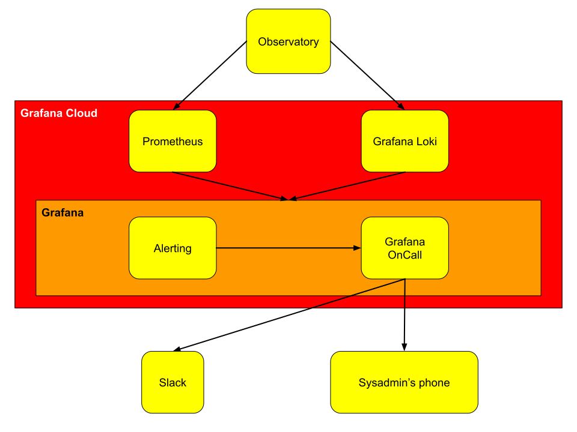

# Observability

## Diagram

If this diagram ever needs to be updated, it can be via its [Google Drawings](https://docs.google.com/drawings/d/11SN_X2YX4R2Kz0tQqCoOADrC-HAPnFB3wW4aHEFvsxA/edit) file.

## Explanation

### Grafana Agent

The Docker image for _Observability_ will contain Grafana Agent. Grafana Agent will be used to ship logs to Grafana Loki, and metrics to Prometheus.

### Grafana Cloud

Grafana Cloud will be used to host Grafana Loki, Prometheus, and Grafana.

Grafana will be used for visualization.

Grafana OnCall will be used to send alerts. Non-urgent alerts will be sent to Slack. Urgent alerts will be sent to Slack, and an audio call will be made to the sysadmin's phone.

### Grafana Loki

Every log generated will have a label named `env` who value will be one of `dev` (used when running the production build locally), `staging` (for use by the staging environment), and `prod` (for use by the production environment).

Every log generated by _Observatory_ will have the label `job` with the value `observatory`.
